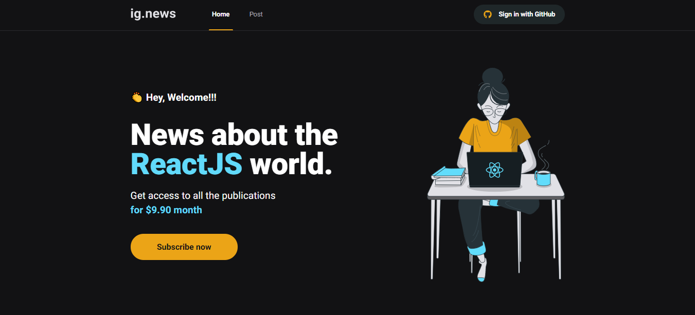
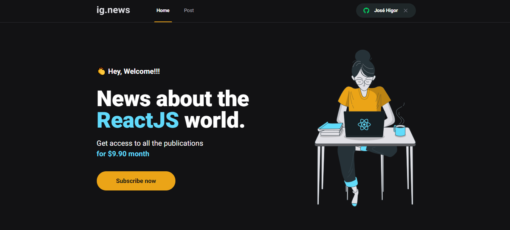
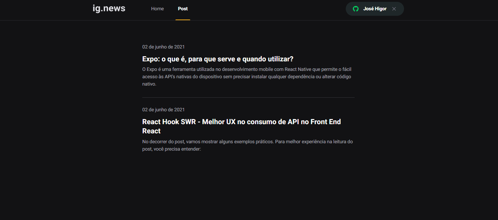
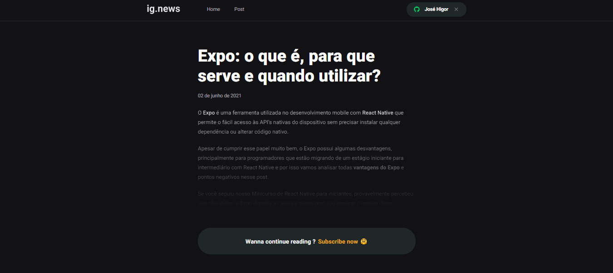
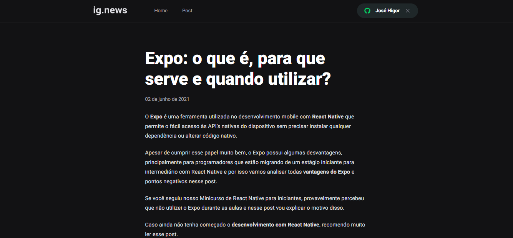

<h1 align="center"> Ig.News 📰</h1>

 Primeira página ainda sem realizar o login com o Github: 

---

 Segunda página após realizar o login com o Github:

---

 Página de posts do blog: 

---

 Página acessada em um determinado post, porém o usuário não tem uma assinatura ativa ainda, então não pode visualizar o conteúdo completo do post 

---

 Após o usuário clicar em "Subscribe now" e ter feito o pagamento de uma assinatura no Stripe, esta é a página redirecionada para visualizar o post por completo:

## 💻 Projeto:
Segundo projeto desenvolvido durante o BootCamp da Rocketseat pelo Ignite - trilha ReactJS. 

Ig.News é uma aplicação que fornece conteúdo pago sobre ReactJS. O usuário faz a autenticação através do login com o Github, 
paga uma assinatura mensal através do Stripe e tem acesso aos posts da aplicação.

O proejto foi desenvolvido utilizando o framework Next.js com os conceitos em consumo de API externas, Server Side Rendering(SSR), Static Site Generation(SSG), 
Stripe para pagamentos da assinatura mensal, Next-Auth para autenticação com Github, 
FaunaDB para armazenar as informações do usuário no banco de dados e Prismic CMS para adição e gerenciamento do conteúdo dos posts.

## 🚀 Tecnologias: 

  As seguintes ferramentas foram usadas no desenvolvimento dessa aplicação:
    <ul>
      <li><a href="https://pt-br.reactjs.org/">ReactJS</a></li>
      <li><a href="https://nextjs.org/">Next.js</a></li>
      <li><a href="https://next-auth.js.org/">Next-Auth</a></li>
      <li><a href="https://www.typescriptlang.org/">TypeScript</a></li>
      <li><a href="https://sass-lang.com">SASS</a></li>
      <li><a href="https://stripe.com">Stripe</a></li>
      <li><a href="https://prismic.io">Prismic-CMS</a></li>
      <li><a href="https://fauna.com">FaunaDB</a></li>
    </ul>
 

## :octocat: Para executar o projeto localmente basta clonar este repositório: 

`git clone https://github.com/zehigor10/ig-news.git`

<h3> Acesse o :open_file_folder: diretório ignews </h3>

`cd ignews`

<h3> Instale todas as :books: bibliotecas presentes no projeto com o comando: </h3>

`yarn`

 <h3> Agora basta executar o projeto :tada: </h3>
 
 `yarn dev`
 
O projeto irá rodar no endereço: <a> http://localhost:3000 </a> 
